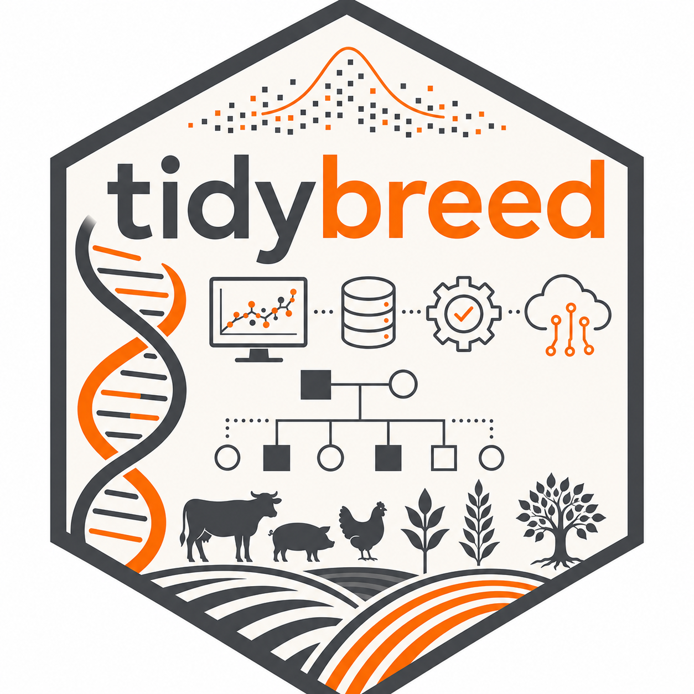

# Introduction

**tidybreed** simulates animal and plant breeding programs using a database-first, pipe-friendly API. All genomic and individual data lives in a file-based [DuckDB](https://duckdb.org/) database — not in R memory — enabling simulations that exceed available RAM and support replication, resumption, and sharing.

The core workflow follows a natural pipeline: initialize a genome, create founders, define traits and their genetic architecture, simulate phenotypes, compute breeding values, and select the next generation.

---

# Design Philosophy

tidybreed is built around six principles that shape every design decision:

::: {.callout-note}
## Core Principles

1. **Database-first** — All data (genotypes, phenotypes, effects, indices) lives in DuckDB, not R objects. R is the control layer, not the storage layer.

2. **File-based by default** — The database is written to disk, enabling simulations larger than RAM, resumable runs, replication across seeds, and easy sharing.

3. **Lazy evaluation** — Use `get_table()` and `filter()` before `collect()`-ing into R. Never pull more data than you need.

4. **Pipe-friendly** — Most exported functions accept a `tidybreed_pop` and return a `tidybreed_pop`. Action functions accept a `tidybreed_table` (from `get_table()`) and also return `tidybreed_pop`.

5. **No implicit ordering** — Never use positional vectors (`TRUE/FALSE` masks, integer indices) to select rows from a table. Row order is not guaranteed. All selection flows through named identifiers (`id_ind`, `locus_name`) or explicit SQL predicates via `filter()`.

6. **No metadata bloat** — Storing scalar metadata like `n_loci` is avoided. Any function that needs locus counts runs a SQL query. This keeps state consistent across restarts and makes `restore_pop()` complete without reconstruction.
:::

## The Two Object Types

| Type | Created by | Purpose |
|------|-----------|---------|
| `tidybreed_pop` | `initialize_genome()` | Carries the DuckDB connection and table registry |
| `tidybreed_table` | `get_table()` | A lazy reference to one table, with optional pending filter |

Most functions return `tidybreed_pop` invisibly, enabling pipe chains. `tidybreed_table` is the input to all action functions (`add_phenotype`, `add_tbv`, `add_genotypes`, `add_additive_effects`, `define_chip`, etc.) and supports `filter()`, `collect()`, `select()`, `arrange()`, `pull()`, and `count()` directly.

---

# Package Architecture

```{mermaid}
%%| eval: true
%%| echo: false
%%| fig-cap: "High-level architecture: R controls the DuckDB backend via dplyr/dbplyr. All data is stored on disk."
%%| fig-width: 10
flowchart TB
    subgraph R["R Session (Control Layer)"]
        direction TB
        POP["tidybreed_pop<br/>(DuckDB connection +<br/>table registry)"]
        TBL["tidybreed_table<br/>(lazy tbl + pending filter)"]
        POP -->|"get_table()"| TBL
        TBL -->|"mutate_table()<br/>add_phenotype()<br/>add_tbv()<br/>add_additive_effects()<br/>define_chip()<br/>extract_genotypes()"| POP
    end

    subgraph DuckDB["DuckDB (Storage Layer — on disk)"]
        direction LR
        GENOME["Genome<br/>genome_meta<br/>genome_haplotype<br/>genome_genotype<br/>genome_effects"]
        IND["Individuals<br/>ind_meta<br/>ind_phenotype<br/>ind_tbv<br/>ind_ebv<br/>ind_index<br/>ind_true_index"]
        TRAIT["Traits<br/>trait_meta<br/>trait_effects<br/>trait_effect_cov"]
        IDX["Selection<br/>index_meta<br/>ind_index<br/>ind_true_index"]
    end

    POP <-->|"DBI / dbplyr"| DuckDB
    style R fill:#dbeafe,stroke:#3b82f6
    style DuckDB fill:#dcfce7,stroke:#16a34a
```

---

# Database Schema

## Entity Relationship Overview

```{mermaid}
%%| eval: true
%%| echo: false
%%| fig-cap: "Core table relationships. All tables share id_ind (VARCHAR) as the individual key."
erDiagram
    genome_meta {
        int locus_id PK
        string locus_name
        int chr
        string chr_name
        double pos_Mb
    }
    genome_effects {
        int id_genome_effect PK
        string locus_name FK
        string trait_name FK
        string line_name
        string genome_effect_type
        double genome_value
        double base_allele_freq
    }
    genome_haplotype {
        string id_ind FK
        int parent_origin
    }
    genome_genotype {
        string id_ind FK
    }
    ind_meta {
        string id_ind PK
        string line_name
        string sex
        string id_parent_1
        string id_parent_2
    }
    trait_meta {
        int id_trait PK
        string trait_name
        string trait_type
        double mean
    }
    trait_effect_cov {
        int id_trait_effect_cov PK
        string effect_name
        string trait_name_1 FK
        string trait_name_2 FK
        double cov_value
    }
    ind_phenotype {
        int id_phenotype PK
        string id_ind FK
        string trait_name FK
        double pheno_value
        int pheno_number
    }
    ind_tbv {
        int id_tbv PK
        string id_ind FK
        string trait_name FK
        double tbv_value
    }
    ind_ebv {
        int id_ebv PK
        string id_ind FK
        string trait_name FK
        double ebv_value
        string model
        int eval_number
    }
    index_meta {
        int id_index_name PK
        string index_name
        string trait_name FK
        double index_weight
        double economic_weight
    }
    ind_index {
        int id_index PK
        string id_ind FK
        string index_name FK
        double index_value
        int index_number
    }
    ind_true_index {
        int id_true_index PK
        string id_ind FK
        string index_name FK
        string weight_type
        double true_index_value
    }

    genome_meta ||--o{ genome_effects : "locus_name"
    trait_meta ||--o{ genome_effects : "trait_name"
    ind_meta ||--o{ genome_haplotype : "id_ind"
    ind_meta ||--o{ genome_genotype : "id_ind"
    ind_meta ||--o{ ind_phenotype : "id_ind"
    ind_meta ||--o{ ind_tbv : "id_ind"
    ind_meta ||--o{ ind_ebv : "id_ind"
    ind_meta ||--o{ ind_index : "id_ind"
    ind_meta ||--o{ ind_true_index : "id_ind"
    trait_meta ||--o{ ind_phenotype : "trait_name"
    trait_meta ||--o{ ind_tbv : "trait_name"
    trait_meta ||--o{ ind_ebv : "trait_name"
    trait_meta ||--o{ trait_effect_cov : "trait_name_1"
    index_meta ||--o{ ind_index : "index_name"
    index_meta ||--o{ ind_true_index : "index_name"
```

## Table Summary

| Table | Rows represent | Key columns |
|-------|---------------|-------------|
| `genome_meta` | One row per locus | `locus_id`, `locus_name`, `chr`, `pos_Mb` |
| `genome_effects` | One row per locus × trait × effect type | `genome_value`, `base_allele_freq`, `genome_effect_type` |
| `genome_haplotype` | Two rows per individual (paternal + maternal) | `id_ind`, `parent_origin`, `locus_1…locus_n` |
| `genome_genotype` | One row per individual | `id_ind`, `locus_1…locus_n` (0/1/2) |
| `ind_meta` | One row per individual | `id_ind`, `sex`, `line_name`, `id_parent_1`, `id_parent_2` |
| `trait_meta` | One row per trait | `trait_name`, `trait_type`, `mean`, `expressed_sex` |
| `trait_effects` | One row per trait × effect | `effect_name`, `effect_class`, `levels_json` |
| `trait_effect_cov` | One row per effect × trait pair | `effect_name`, `cov_value` (variance on diagonal) |
| `ind_phenotype` | One row per individual × trait × record | `pheno_value`, `pheno_number` |
| `ind_tbv` | One row per individual × trait | `tbv_value` |
| `ind_ebv` | One row per individual × trait × model × eval | `ebv_value`, `model`, `eval_number` |
| `index_meta` | One row per index × trait | `index_name`, `index_weight`, `economic_weight` |
| `ind_index` | One row per individual × index × run | `index_value`, `index_number` |
| `ind_true_index` | One row per individual × index × weight type | `true_index_value`, `weight_type` |

---

# Function Workflow

## Full Pipeline Overview

```{mermaid}
%%| eval: true
%%| echo: false
%%| fig-cap: "Complete function calling pipeline. Phases must proceed roughly top to bottom; within a phase, order is flexible."
flowchart TD
    A(["Start"]) --> P1

    subgraph P1["Phase 1 — Initialize"]
        F1["initialize_genome()<br/>pop_name, n_loci, n_chr,<br/>chr_len_Mb, n_haplotypes"]
    end

    subgraph P2["Phase 2 — Population"]
        F2["add_founders()<br/>n_males, n_females, line_name"]
        F2B["add_offspring()<br/>mating design, recombination"]
        F2 --> F2B
    end

    subgraph P3["Phase 3 — Traits"]
        F3["add_trait()<br/>trait_name, trait_type,<br/>target_add_var, residual_var"]
        F3B["add_effect_fixed_class()<br/>add_effect_fixed_cov()<br/>add_effect_random()"]
        F3 --> F3B
    end

    subgraph P4["Phase 4 — Genetic Architecture"]
        F4["get_table('genome_meta') |><br/>  filter(chr %in% 1:5) |><br/>  add_additive_effects(trait_name)"]
        F4B["set_qtl_effects_multi()<br/>(correlated multi-trait)"]
    end

    subgraph P5["Phase 5 — Phenotypes & TBVs"]
        F5["get_table('ind_meta') |><br/>  filter(sex == 'F') |><br/>  add_phenotype(trait_name)"]
        F5N["Note: add_phenotype()<br/>calls add_tbv() internally"]
        F5B["get_table('ind_meta') |><br/>  add_tbv(trait_name,<br/>  index_names = 'idx1')"]
        F5 -. "OR (TBVs only)" .-> F5B
        F5 --> F5N
    end

    subgraph P6["Phase 6 — EBVs"]
        F6["add_ebv()<br/>(import from external BLUP/GBLUP)"]
    end

    subgraph P7["Phase 7 — Selection Index"]
        F7["define_index()<br/>index_name, trait_names, index_wts"]
        F7B["get_table('ind_ebv') |><br/>  filter(eval_number == max) |><br/>  add_index(index_name)"]
        F7 --> F7B
    end

    subgraph P8["Phase 8 — Next Generation"]
        F8["select_parents() [planned]<br/>— truncation or index selection"]
        F8B["add_offspring()<br/>new generation from selected parents"]
        F8 --> F8B
    end

    P1 --> P2
    P2 --> P3
    P3 --> P4
    P4 --> P5
    P5 --> P6
    P6 --> P7
    P7 --> P8
    P8 -->|"repeat for G generations"| P5

    style P1 fill:#dbeafe,stroke:#3b82f6
    style P2 fill:#fef9c3,stroke:#ca8a04
    style P3 fill:#fce7f3,stroke:#db2777
    style P4 fill:#ede9fe,stroke:#7c3aed
    style P5 fill:#dcfce7,stroke:#16a34a
    style P6 fill:#ffedd5,stroke:#ea580c
    style P7 fill:#cffafe,stroke:#0891b2
    style P8 fill:#f1f5f9,stroke:#64748b
```

## add_phenotype() Internal Flow

`add_phenotype()` is the most complex function. It internally calls `add_tbv()` before computing phenotypes.

```{mermaid}
%%| eval: true
%%| echo: false
%%| fig-cap: "Internal logic of add_phenotype(). TBVs are always computed first, then fixed/random effects are added, then residuals."
flowchart TD
    AP["add_phenotype(tbl, trait_name)"] --> TBV

    subgraph TBV["Step 1 — Compute TBVs (via add_tbv())"]
        T1["Read genome_effects<br/>for each trait"]
        T2["Join to genome_genotype<br/>for selected individuals"]
        T3["TBV = sum(a_i × g_i)<br/>across all QTL loci"]
        T4["Center by 2 × sum(a_i × p_i)<br/>(Falconer mean centering)"]
        T1 --> T2 --> T3 --> T4
    end

    subgraph PHE["Step 2 — Build Phenotype"]
        P1["Start with intercept<br/>(target_add_mean)"]
        P2["Add fixed class effects<br/>(e.g. sex: M+30, F+0)"]
        P3["Add fixed covariate effects<br/>(slope × (x - center))"]
        P4["Add random effects<br/>(draw from N(0, σ²_rand))"]
        P5["Add TBV"]
        P6["Sample residual<br/>MVN(0, R) across traits"]
        P1 --> P2 --> P3 --> P4 --> P5 --> P6
    end

    subgraph CONV["Step 3 — Trait Conversion"]
        C1{"trait_type?"}
        C2["continuous → y as-is"]
        C3["count → clip to min/max"]
        C4["binary → liability → 0/1<br/>via prevalence threshold"]
        C5["categorical → liability → levels<br/>via threshold cutpoints"]
        C1 --> C2
        C1 --> C3
        C1 --> C4
        C1 --> C5
    end

    TBV --> PHE --> CONV

    subgraph WRITE["Step 4 — Write to DuckDB"]
        W1["INSERT INTO ind_tbv"]
        W2["INSERT INTO ind_phenotype"]
    end

    CONV --> WRITE

    style TBV fill:#ede9fe,stroke:#7c3aed
    style PHE fill:#dcfce7,stroke:#16a34a
    style CONV fill:#fce7f3,stroke:#db2777
    style WRITE fill:#dbeafe,stroke:#3b82f6
```

## Selection Index Flow

```{mermaid}
%%| eval: true
%%| echo: false
%%| fig-cap: "Selection index computation. define_index() sets weights; add_index() applies them to EBVs."
flowchart LR
    subgraph SETUP["Index Setup"]
        DI["define_index(pop,<br/>  index_name = 'sel_idx',<br/>  trait_names = c('ADG','BW'),<br/>  index_wts = c(0.6, 0.4))"]
        IM[("index_meta<br/>(weights stored<br/>per trait)")]
        DI --> IM
    end

    subgraph COMPUTE["Index Computation"]
        GE["get_table('ind_ebv') |><br/>  filter(eval_number == 1)"]
        AI["add_index('sel_idx')"]
        II[("ind_index<br/>(index_value<br/>per individual)")]
        GE --> AI --> II
    end

    subgraph TRUE_IDX["True Index (from TBVs)"]
        AT["add_tbv(...,<br/>  index_names = 'sel_idx',<br/>  type = 'both')"]
        TI[("ind_true_index<br/>(true_index_value<br/>per individual)")]
        AT --> TI
    end

    IM --> AI
    style SETUP fill:#fce7f3,stroke:#db2777
    style COMPUTE fill:#dcfce7,stroke:#16a34a
    style TRUE_IDX fill:#fef9c3,stroke:#ca8a04
```

---

# Key Patterns

## The get_table() → filter() → action() Pattern

All action functions take a `tidybreed_table` (not `tidybreed_pop`) as their first argument. This enables row subsetting before any computation:

```r
# All females in generation 1
pop <- pop |>
  get_table("ind_meta") |>
  dplyr::filter(sex == "F", gen == 1L) |>
  add_phenotype("ADG")

# Only loci on chromosomes 1–5 become QTL
pop <- pop |>
  get_table("genome_meta") |>
  dplyr::filter(chr %in% 1:5) |>
  add_additive_effects("ADG")

# Define a chip from a random sample of loci
sel <- pop |>
  get_table("genome_meta") |>
  collect() |>
  dplyr::slice_sample(n = 500) |>
  dplyr::pull(locus_name)

pop <- pop |>
  get_table("genome_meta") |>
  dplyr::filter(locus_name %in% sel) |>
  define_chip("50K")
```

## Custom Column Forwarding (`...`)

`add_founders()`, `add_offspring()`, `add_phenotype()`, `add_tbv()`, and `add_ebv()` all accept `...` for custom columns inserted atomically with the new rows:

```r
# gen and farm written together with founder records
pop <- pop |>
  add_founders(
    n_males   = 10,
    n_females = 100,
    line_name = "Angus",
    gen       = 0L,        # INTEGER (note the L suffix)
    farm      = "Iowa"     # VARCHAR
  )
```

::: {.callout-warning}
## Type suffix matters
`gen = 0` gives a `DOUBLE` column. `gen = 0L` gives `INTEGER`. Use R's type suffixes (`L`, `NA_integer_`, `NA_real_`, `NA_character_`, `as.Date(...)`) to get the intended DuckDB type.
:::

## Pre-declaring Column Schemas

When you want typed columns before any data exists (useful for multi-generation loops):

```r
# After initialize_genome(), declare types on empty table
pop <- pop |>
  get_table("ind_meta") |>
  mutate_table(gen = NA_integer_, farm = NA_character_)

# add_founders fills values in; types already match
pop <- pop |>
  add_founders(n_males = 10, n_females = 100, line_name = "A",
               gen = 0L, farm = "Iowa")
```

## Multi-trait Correlated Effects

```r
# Define G matrix (genetic covariance across traits)
G <- matrix(c(100, 40, 40, 25), nrow = 2,
            dimnames = list(c("ADG","BW"), c("ADG","BW")))
pop <- pop |> add_effect_cov_matrix("gen_add", G)

# Assign correlated QTL effects
pop <- pop |>
  get_table("genome_meta") |>
  dplyr::filter(chr %in% 1:10) |>
  set_qtl_effects_multi(trait_names = c("ADG", "BW"))
```

---

# Minimal Working Example

A complete single-generation simulation:

```r
library(tidybreed)
library(dplyr)

# 1. Initialize
pop <- initialize_genome(
  pop_name      = "demo",
  n_loci        = 10000,
  n_chr         = 10,
  chr_len_Mb    = 100,
  n_haplotypes  = 1000,
  db_path       = tempfile(fileext = ".duckdb")
)

# 2. Create founders (generation 0)
pop <- pop |>
  add_founders(
    n_males   = 50,
    n_females = 500,
    line_name = "Angus",
    gen       = 0L
  )

# 3. Define a trait with additive genetic and residual variance
pop <- pop |>
  add_trait(
    trait_name     = "ADG",
    trait_type     = "continuous",
    target_add_var = 100,
    residual_var   = 150
  )

# 4. Assign QTL effects (random sample of 200 loci)
qtl_loci <- get_table(pop, "genome_meta") |>
  collect() |>
  slice_sample(n = 200) |>
  pull(locus_name)

pop <- pop |>
  get_table("genome_meta") |>
  filter(locus_name %in% qtl_loci) |>
  add_additive_effects("ADG")

# 5. Simulate phenotypes for all founders
pop <- pop |>
  get_table("ind_meta") |>
  add_phenotype("ADG")

# 6. Inspect results
get_table(pop, "ind_phenotype") |> collect() |> summary()
get_table(pop, "ind_tbv")       |> collect() |> summary()

# 7. Define and compute a selection index (if you have EBVs)
# pop |> define_index("idx1", trait_names = "ADG", index_wts = 1) |>
#   get_table("ind_ebv") |> add_index("idx1")

# 8. Clean up
close_pop(pop)
```

---

# Function Reference Summary

```{mermaid}
%%| eval: true
%%| echo: false
%%| fig-cap: "Function naming convention and purpose. Functions are grouped by prefix."
mindmap
  root((tidybreed))
    initialize_
      initialize_genome
    add_
      add_founders
      add_offspring
      add_trait
      add_trait_simple
      add_additive_effects
      add_phenotype
      add_tbv
      add_ebv
      add_index
      add_effect_fixed_class
      add_effect_fixed_cov
      add_effect_random
      add_effect_cov_matrix
    define_
      define_chip
      define_index
      define_table
    mutate_
      mutate_table
    get_
      get_table
    set_
      set_qtl_effects_multi
    extract_
      extract_genotypes
    restore_
      restore_pop
```

## Function Naming Convention

| Prefix | Meaning | Examples |
|--------|---------|---------|
| `initialize_` | Create the DuckDB database and all core tables | `initialize_genome()` |
| `add_` | Insert new rows (individuals, traits, effects, values) | `add_founders()`, `add_phenotype()` |
| `mutate_` | Add or update columns in an existing table | `mutate_table()` |
| `define_` | Convenience wrapper for common mutate/metadata tasks | `define_chip()`, `define_index()`, `define_table()` |
| `get_` | Access a table as a lazy `tidybreed_table` | `get_table()` |
| `set_` | Replace/overwrite existing values | `set_qtl_effects_multi()` |
| `extract_` | Pull data in a specialized format | `extract_genotypes()` |
| `restore_` | Reconnect to an existing database file | `restore_pop()` |

## Naming Consistency Rules

| Pattern | Correct | Wrong |
|---------|---------|-------|
| Value columns | `pheno_value`, `tbv_value`, `ebv_value`, `cov_value`, `index_value` | `phenotype`, `tbv`, `value` |
| Name/label columns | `trait_name`, `locus_name`, `line_name`, `index_name` | `trait`, `locus`, `line` |
| ID foreign keys | `id_ind`, `id_trait`, `id_tbv` | `ind_id`, `phenotype_id` |
| Argument names | match the database column they populate exactly | any other alias |

---

# Versioning

tidybreed uses three-part semantic versioning (`MAJOR.MINOR.PATCH`):

| Part | Bump when |
|------|-----------|
| PATCH | Bug fixes, doc updates, minor internal changes |
| MINOR | New exported functions or non-breaking feature additions |
| MAJOR | Breaking API changes |

Every release updates both `DESCRIPTION` and `NEWS.md`.

---

# Roadmap

| Feature | Status |
|---------|--------|
| Core genome + founder initialization | ✅ Complete |
| Multi-trait additive effects (correlated) | ✅ Complete |
| Fixed and random environmental effects | ✅ Complete |
| Continuous, count, binary, categorical traits | ✅ Complete |
| Selection index (EBV-based and TBV-true) | ✅ Complete |
| Custom tables and columns via `define_table()` / `mutate_table()` | ✅ Complete |
| `restore_pop()` — resume from saved database | ✅ Complete |
| BLUP output parsing (`blupf90_helpers`) | ✅ Complete |
| `select_parents()` — truncation / index selection | 🔜 Planned |
| Dominance and epistasis effects | 🔜 Planned |
| Export: PLINK `.bed/.bim/.fam`, VCF | 🔜 Planned |
| Visualization helpers | 🔜 Planned |
